Hello hackers, makers, and fellow doers-of-things!

HackRVA decided to get in the "remodel mood" this winter.

We got a little crazy and built such things as a sliding barn door for the tech lab, beautiful new work tables, custom computer desks, and an outdoor metal working area .

Thanks to all the members who helped build it! And a special thanks to [Matt for doing a lot of the heavy lifting](https://www.instagram.com/isthatmattporr/). These projects exist because of his extra effort and dedicated labors.

Check out the cool pics below, AND more pics after the break below!

[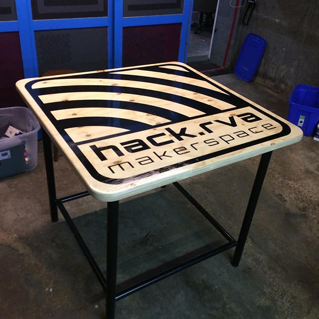](http://www.hackrva.org/blog/wp-content/uploads/2017/02/mattpics-3.jpg) [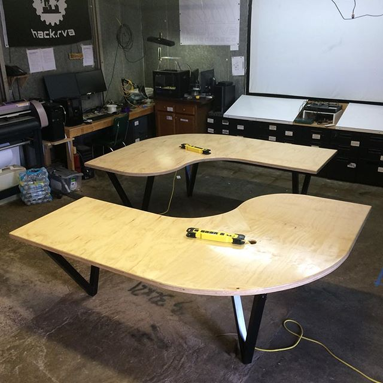](http://www.hackrva.org/blog/wp-content/uploads/2017/02/mattpics-10.jpg) [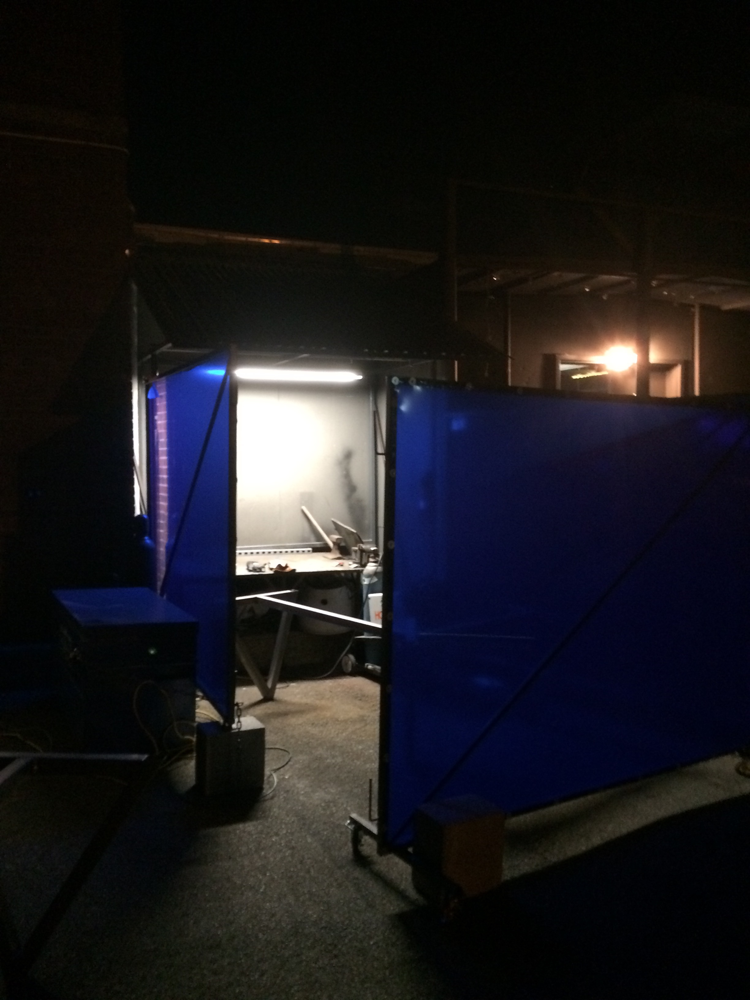](http://www.hackrva.org/blog/wp-content/uploads/2017/02/metal-working-area-3.jpg)

[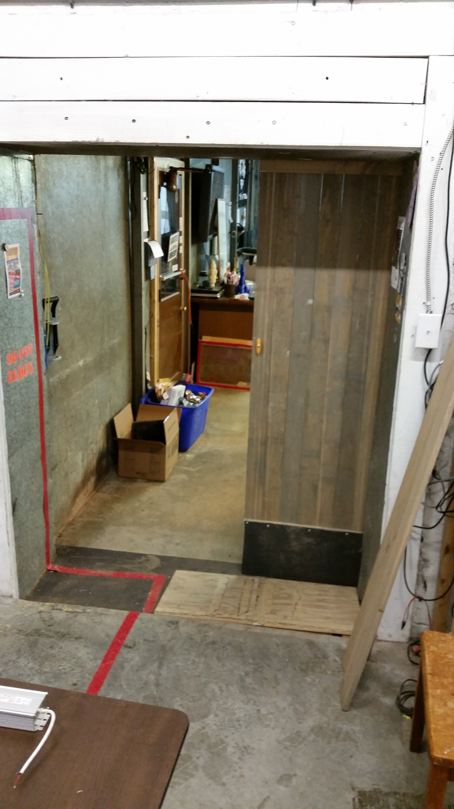](http://www.hackrva.org/blog/wp-content/uploads/2017/02/barnDoor.jpg)

[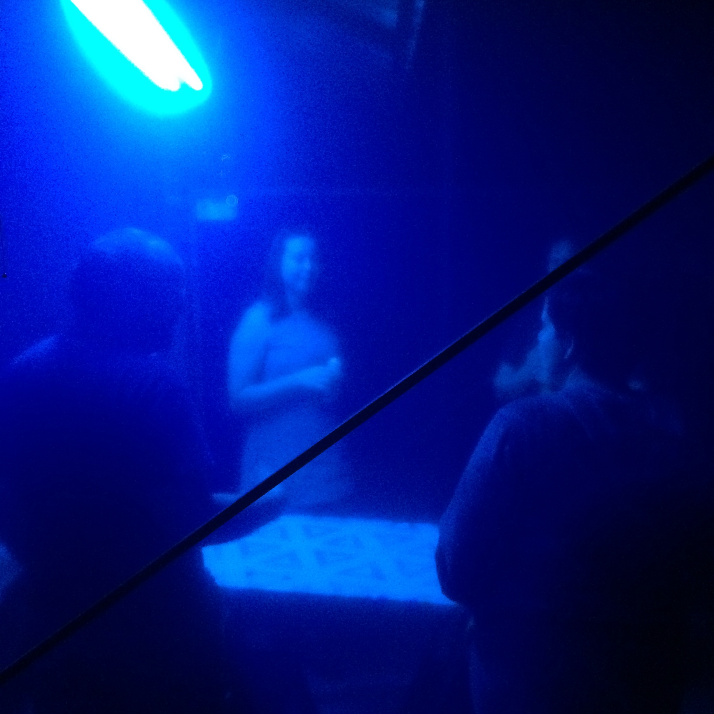](http://www.hackrva.org/blog/wp-content/uploads/2017/02/metal-working-area-2.jpg)

[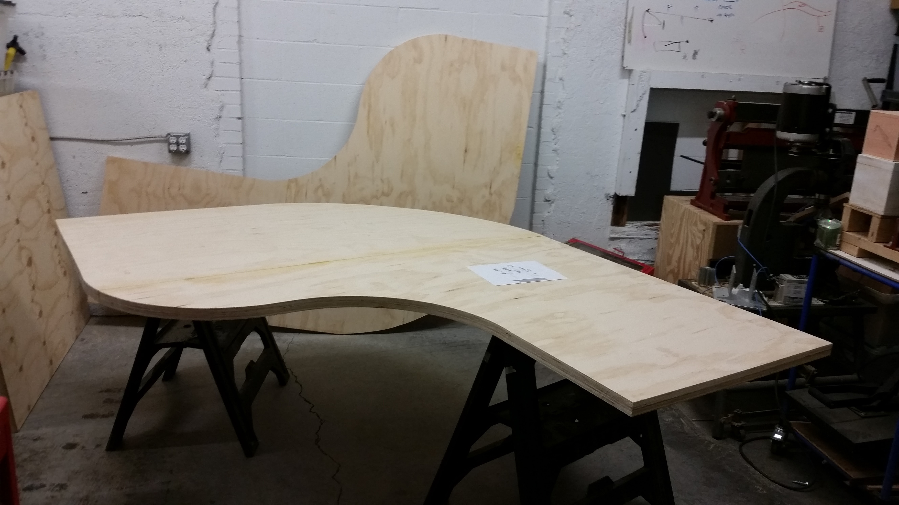](http://www.hackrva.org/blog/wp-content/uploads/2017/02/20161218_164746.jpg) [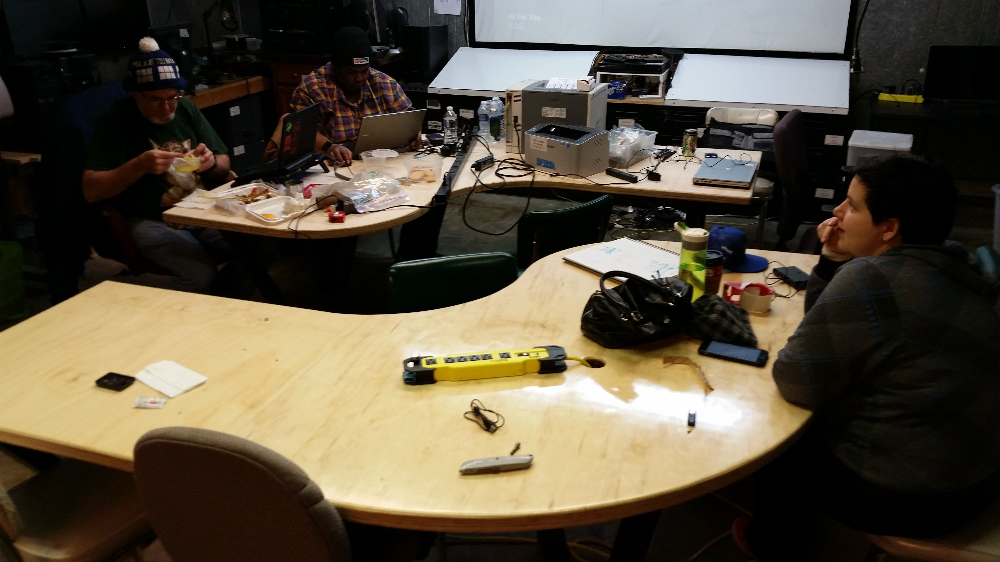](http://www.hackrva.org/blog/wp-content/uploads/2017/02/20170115_014230.jpg) [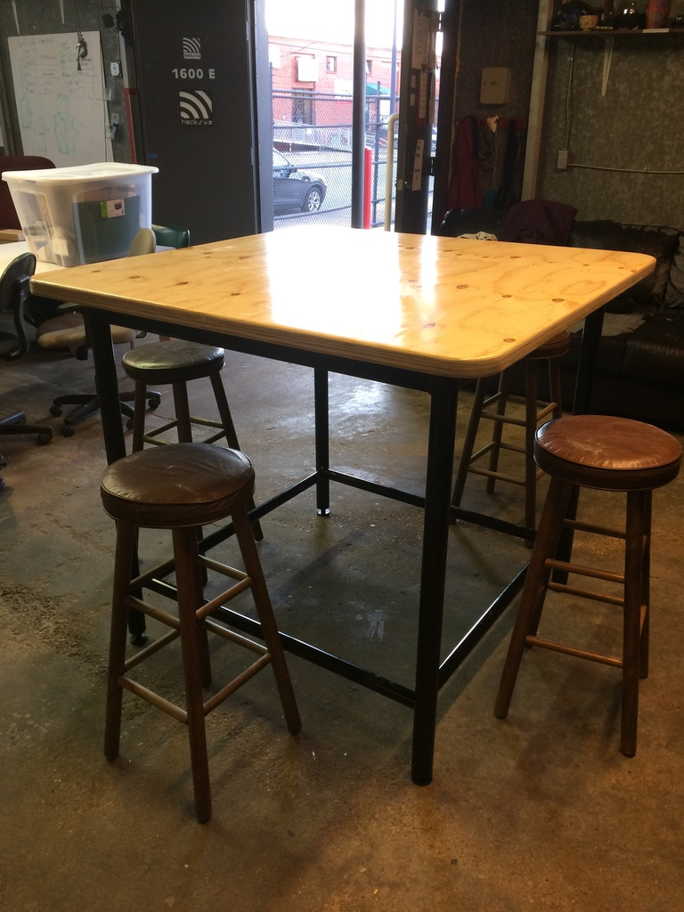](http://www.hackrva.org/blog/wp-content/uploads/2017/02/bar_table_is_done__except_for_the_stencil._i_m_learning_the_vinyls_plotter_next_week_and_the_stencil_will_happen_after_that._1024.jpg) [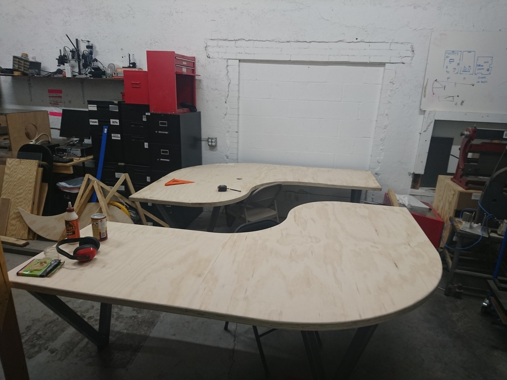](http://www.hackrva.org/blog/wp-content/uploads/2017/02/dsc_0279_1024.jpg) [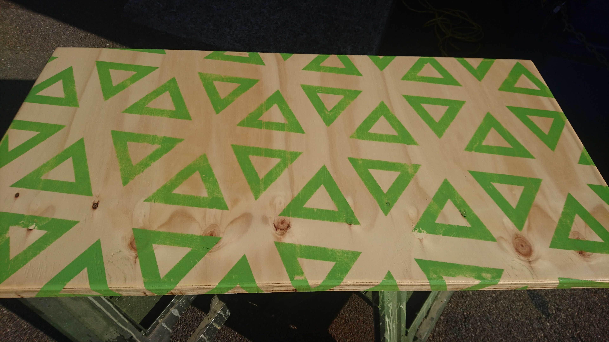](http://www.hackrva.org/blog/wp-content/uploads/2017/02/dsc_0406.jpg) [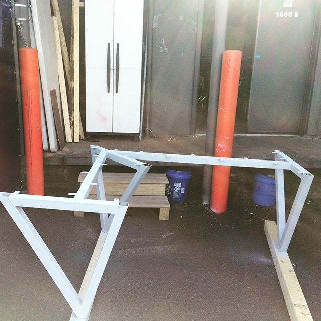](http://www.hackrva.org/blog/wp-content/uploads/2017/02/mattpics-1.jpg) [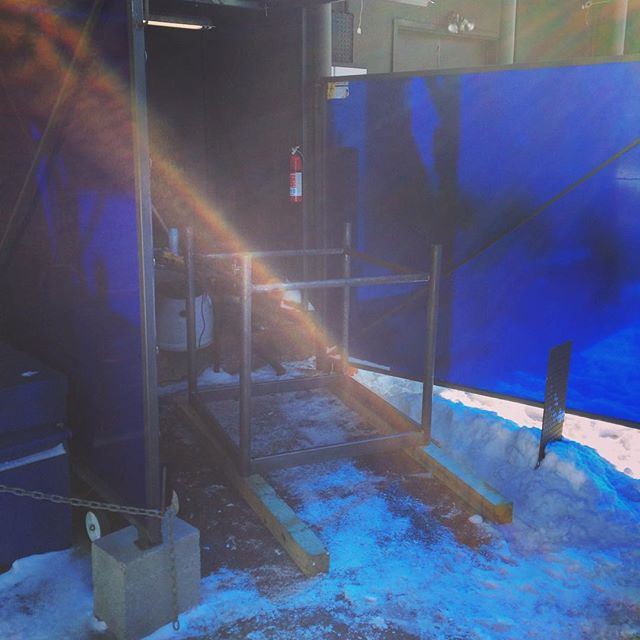](http://www.hackrva.org/blog/wp-content/uploads/2017/02/mattpics-2.jpg) [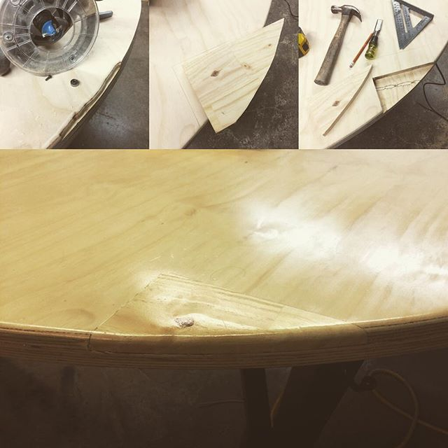](http://www.hackrva.org/blog/wp-content/uploads/2017/02/mattpics-5.jpg) [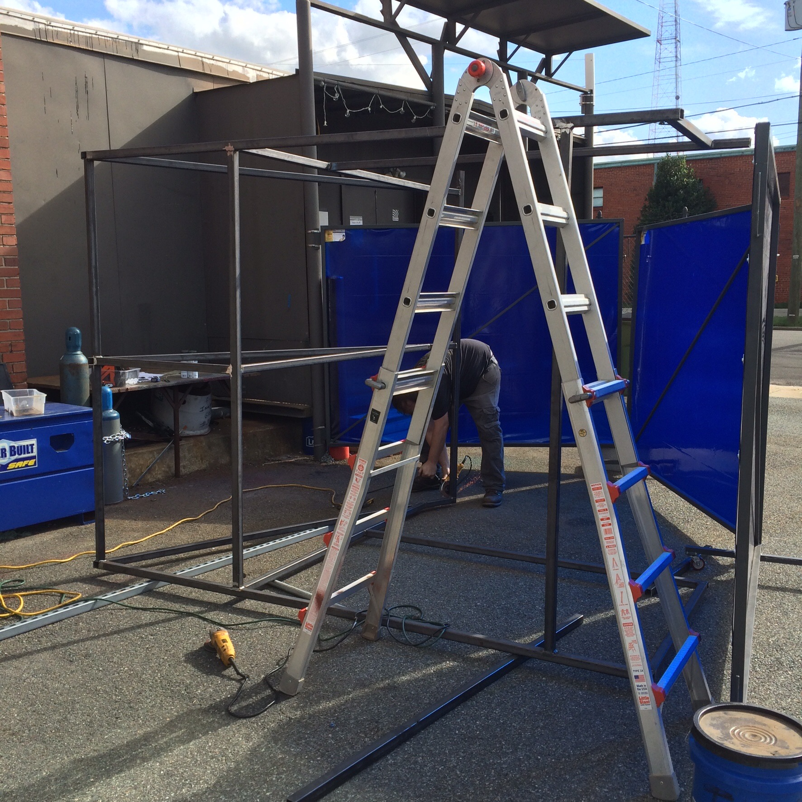](http://www.hackrva.org/blog/wp-content/uploads/2017/02/metal-working-area-1.jpg) [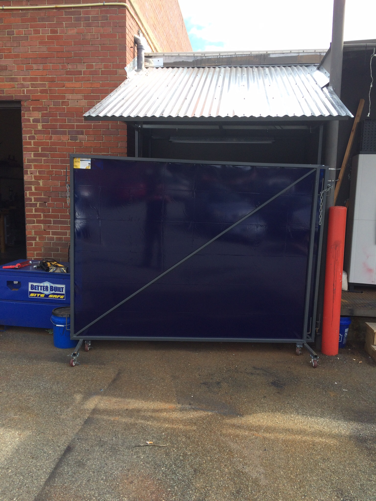](http://www.hackrva.org/blog/wp-content/uploads/2017/02/metal-working-area-4.jpg)
