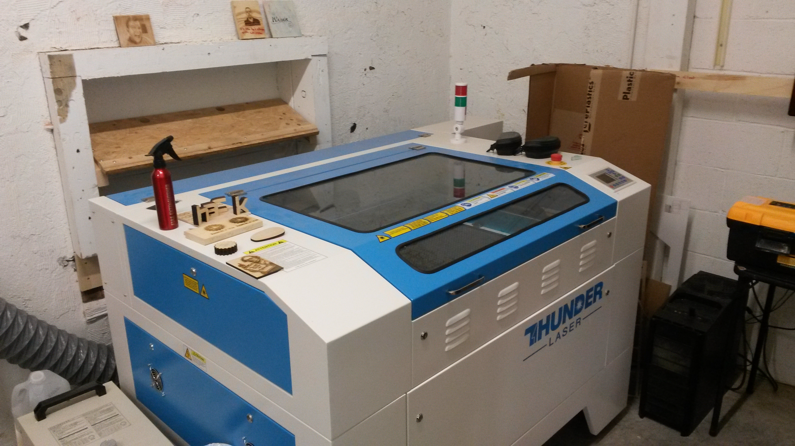
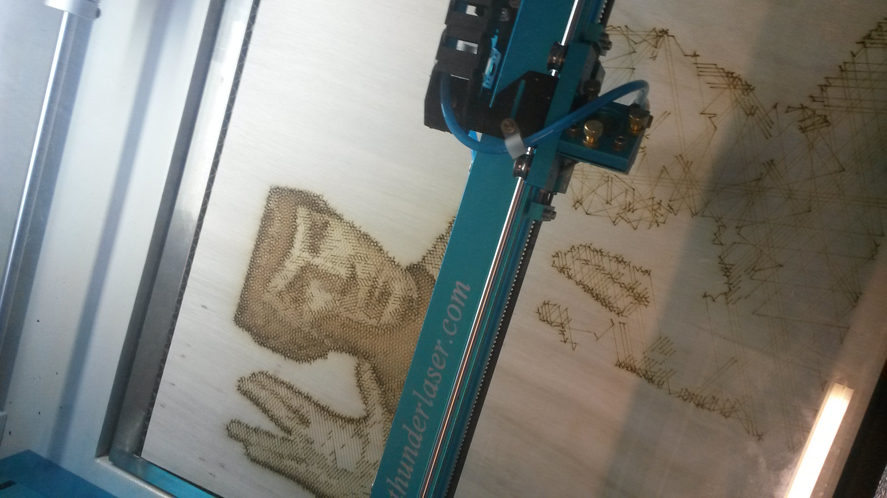

We have a new laser cutter! It's a ThunderLaser 100 Watt CO2 laser with a 35x24 inch cutting area. Great for cutting paper, acrylic sheet, plywood, and a variety of other materials.

If you want to use this awesome new tool, check out the [wiki page for the laser cutter](https://wiki.hackrva.org/index.php/Thunder_Laser) for more details. You'll need to get checked out on it by a qualified member before you can use it. Live long and prosper!

