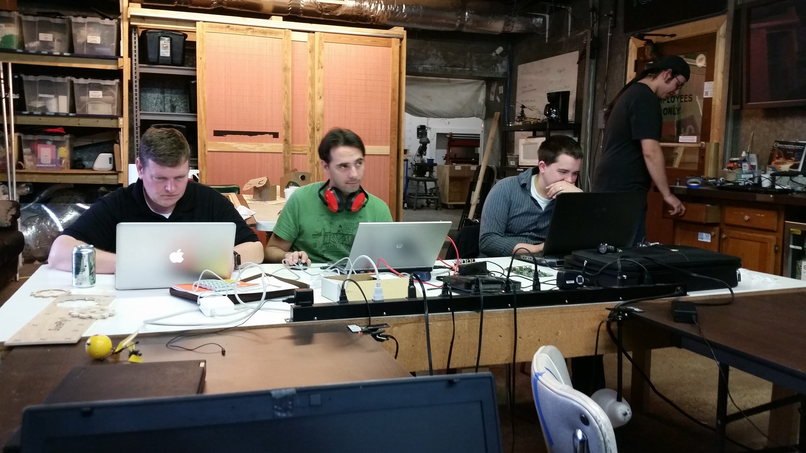

At this writing, we've been doing Open Code night every month for about a year.

Open Code happens on the last Tuesday of every month. It's a non-formal event where developers (of any experience level) geo-sync in meatspace to:

1. hang out and talk about projects they are working on
2. seek in person assistance from other developers
3. trade button mashing war stories
4. or just hang out and meet other developers

https://www.meetup.com/HackRVA-Meetup/events/djlwgqyxqbhc/

Eye contact is optional.
