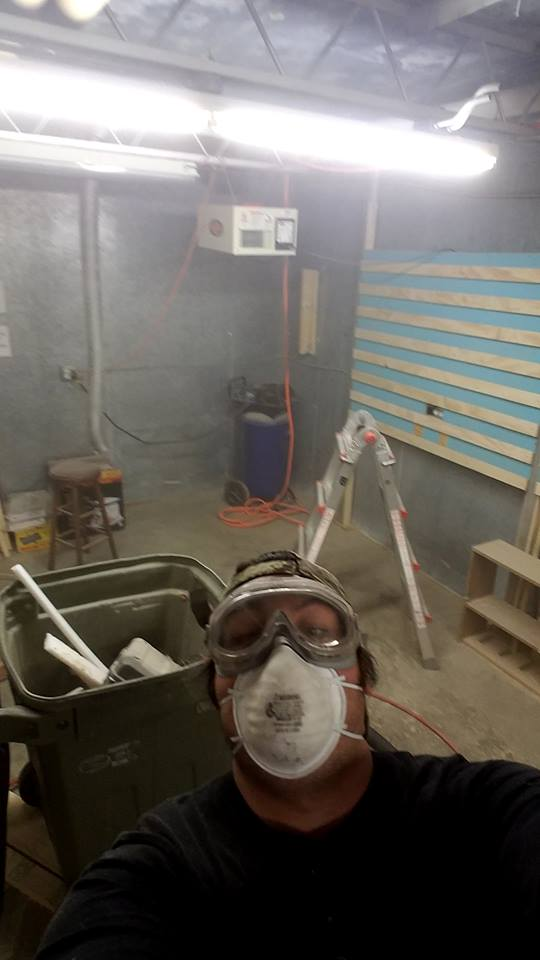
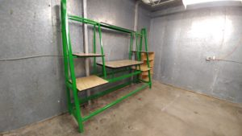
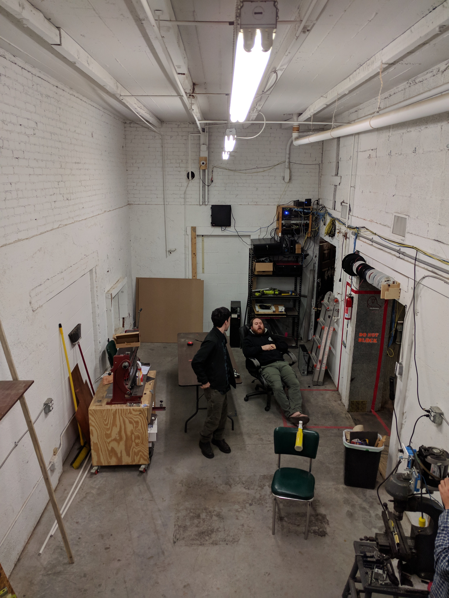

Project Room swap was a grand success! It took several committed members, a good deal of planning, and some well executed sweat.

The new Techlab is outfitted with a brand new 3D printing station(see green desk picture below,) the laser cutter, the T-shirt making kit, our server nook (a nook that where are servers are located,) and  plenty of tools for working with electronics!

 

Many thanks to all the wonderful hard working people that made this possible.

Come on down and check out the progress!

 

some pics of us cleaning out the rooms:

  

 

 

Here is a document we used during the process to flesh out some ideas:

https://docs.google.com/document/d/1Z\_pKg4T0TFAe1JLU9nFlyXeTnzQQSGQfGog0ZrR\_Ipo/edit?usp=sharing
