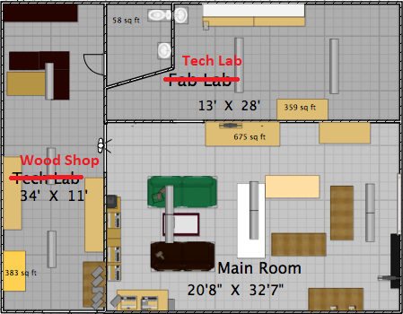

In efforts to make better use of our space, we have decided to move our rooms around.  The current Wood Shop will become the new Tech Lab and vice versa. This gives the woodshop a little more room, access to exterior doors, and it allows for us to organize the woodshop from the ground up in a functional layout. The Tech Lab will gain more isolation and from the rest of the space and provide an environment that will make it easier to mitigate dust for some of our dust sensitive activities (e.g. etching circuit boards.)  We hope that we can get further use out of this room by using it to host some workshops that wouldn't shutdown the entire space. 

This idea has been tossed around in the past, but we now have enough people behind it who are dedicated to make it happen.

 

**When is this happening?**

This is happening soon.  In fact, this is happening next week (starting January 6th.)

 

**What needs to happen?**

The HVAC air intake has been moved to the main room.

The thermostat will be moved to the main room soon.

We will be building a ramp in the throughway between the new wood shop and the main room as well as a new double doors.

The network rack will be relocated to the new Tech Lab.

Certain items will be prestaged in the main room while we allocate space for them in their new location.  We will be keeping the two tables in the main room clear so that they can be used as per usual.

 

**How will this effect the space during the move?**

Unfortunately, we will need to take some tools offline during the move.

The laser will go offline on Thursday Jan 4th, and will not be available until after the move is completed.

The FormLabs 3d resin printer will go offline Jan 4th and will not be available until after the move is completed.

The CNC router will go offline on Friday Jan 5th.  We will work to get this operational as soon as possible.  However, it might not be available until after the move is completed.

There will be limited availability to the tools in the woodshop during the move.  These will likely be moved first.  However, they will need to make their way to their new

 

**How can you contribute?**

If you would like to help with the move, we invite you to come to the space any day in the upcoming week to lend a hand.  We will likely need a lot of help with cleaning and physically moving things.

 

The blog is still dead.
