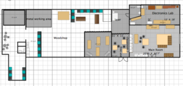
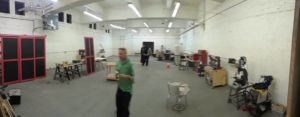

#### **HACKRVA IS EXPANDING**

We bought a sledge hammer, tore the wall down, and proceeded to plant a flag in our neighboring space.

Just kidding.  In the real world we started paying our landlord more money for more space!

We've more than tripled our space.

 

 

The new big room will primarily serve as "The Shop."  HUGE space!!!

With the new space, we now have large work benches for working on projects and new metal working tools (recently colocated.)  Keep an eye on the [Metal Machining](https://wiki.hackrva.org/index.php/Metal_Machining) wiki page for updates on the new metal working tools and inquire on [slack](https://wiki.hackrva.org/index.php/Online_Chat_Channel) about getting training.

We are also planning on building more member storage in this space.

With the shop clearing out of the white room, the room will now be used as a small classroom and space for our new laser (stay tuned -- we will post about the new laser soon.)

 

Come on down to check out the progress and give input on what you want to see happen in this new space!

We will be making constant efforts to build this out.

 

