Every year HackRVA builds the "I'm attending this conference" badge for [RVASec](https://rvasec.com/).  Desiging the badge, Etching the circuit boards, populating the boards with components, and writing software is all done in house by HackRVA members.  The badges contain things like the schedule to the conference, games, and hidden secrets to the CTF ([capture the flag](https://rvasec.com/ctf/)).

 

For several months the Badge team would meet for project planning and build days.  A lot of hard work went into this years badge build and many different hands got involved.

A big thanks to the team for pulling off some amazing accomplishments.  Overall the badges were very well received by conference goers.

Badge 2019 was a huge success.  Some even said, "Best badge year yet!"

[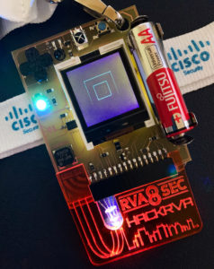](https://www.hackrva.org/wp-content/uploads/2019/07/Badge.jpg)[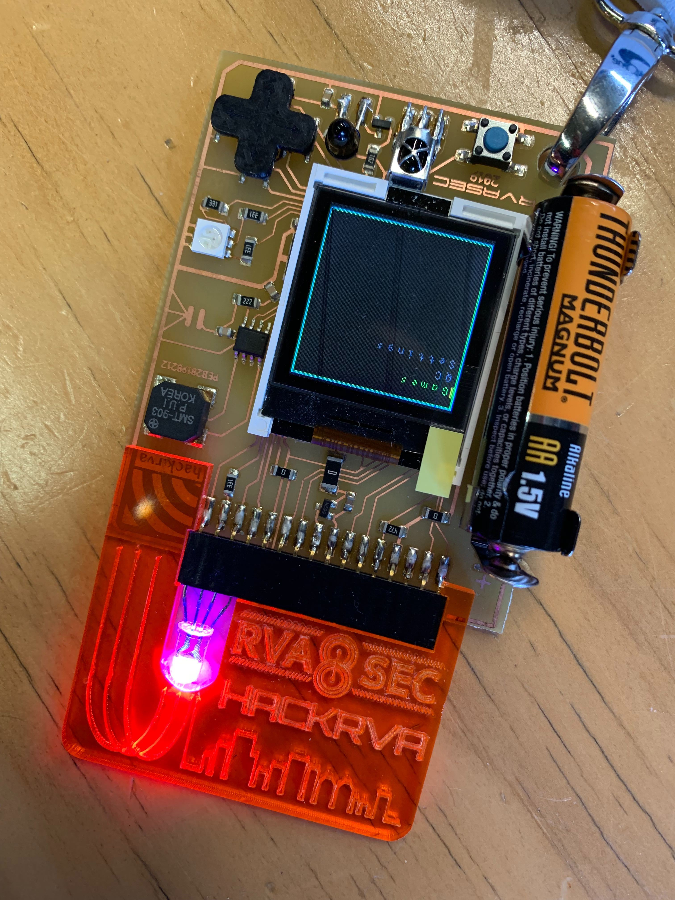](https://www.hackrva.org/wp-content/uploads/2019/07/Image-from-iOS-1.jpg)[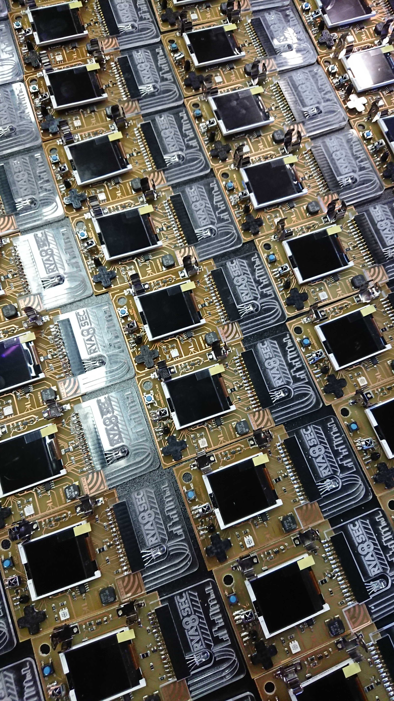](https://www.hackrva.org/wp-content/uploads/2019/07/DSC_1805.jpg)

 

[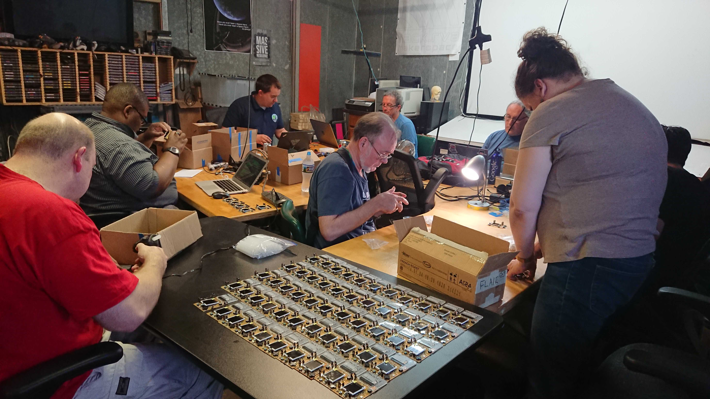](https://www.hackrva.org/wp-content/uploads/2019/07/DSC_1807.jpg)[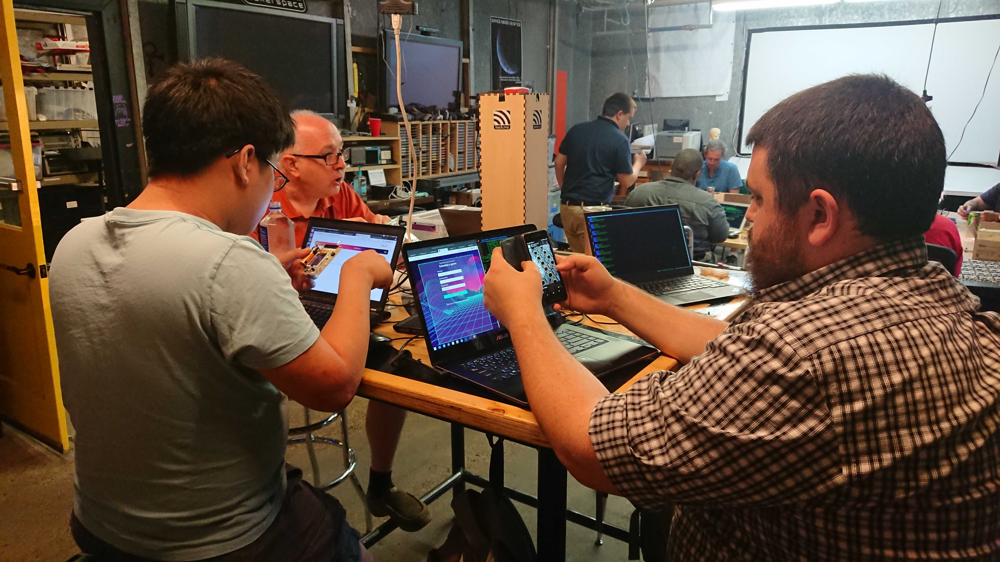](https://www.hackrva.org/wp-content/uploads/2019/07/DSC_1806.jpg)

### Cool features and games from the 2019 badge

#### Laser Tag:

The badges were equipped with infrared emitters and receivers.  We sent packets over IR (infrared) that contained information such as who hit you and when.  This information was later collected in the base station which would display stats and information about these games.

Base Station code: https://github.com/HackRVA/master-base-2019

Laser Tag code can be found in the 2019 badge firmware repo: https://github.com/HackRVA/badge2019interp

 

#### Maze:

The Maze game is a procedurally generated dungeon crawler where players can fight monsters and win loot.  To win you must crawl through the maze, find the chalice of obfuscation, and make it out alive.

As with any procedurally generated game, every time you play it you will get a different experience!

 

It was very interesting to see a procedurally generated game on an embedded system such as the badge.

Maze code can found in the 2019 badge firmware repo: https://github.com/HackRVA/badge2019interp

[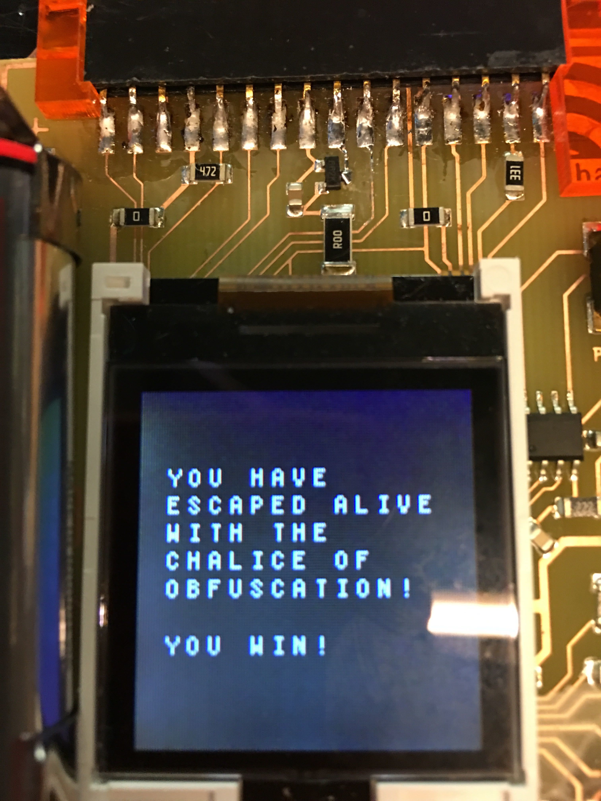](https://www.hackrva.org/wp-content/uploads/2019/07/Image-from-iOS.jpg)

[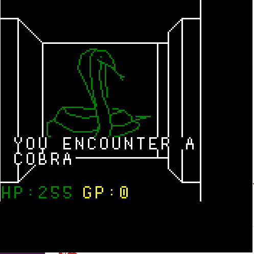](https://www.hackrva.org/wp-content/uploads/2019/07/3PCBTHT.jpg)[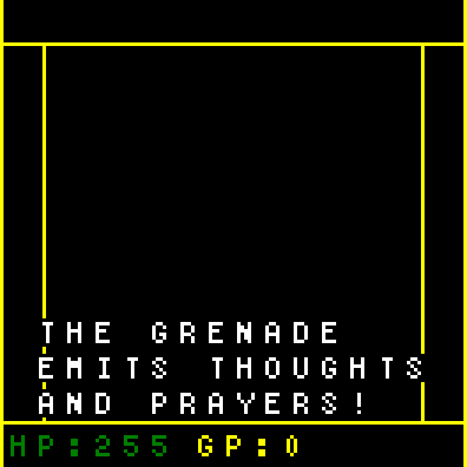](https://www.hackrva.org/wp-content/uploads/2019/07/image-4.png)[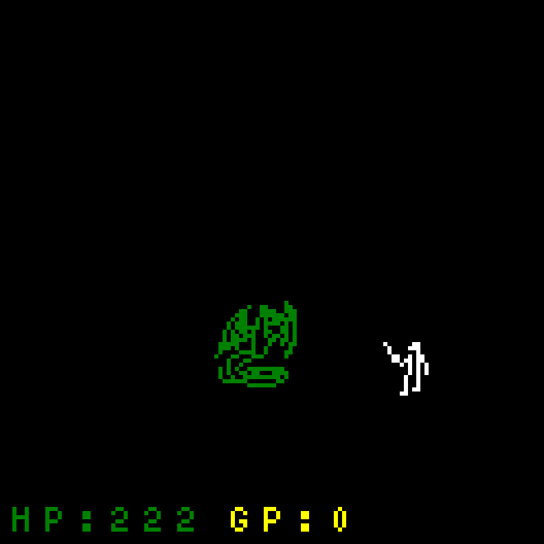](https://www.hackrva.org/wp-content/uploads/2019/07/image-5.png)

 

#### Badge Monsters:

Badge Monsters was kind of a social game where players could walk around the conference and exchange badge monsters to try to collect them all.

It was fun to see people running around the halls of the RVASec conference asking each other "which badge monster do you have?"

There was even a meme within the first hour of the conference:

[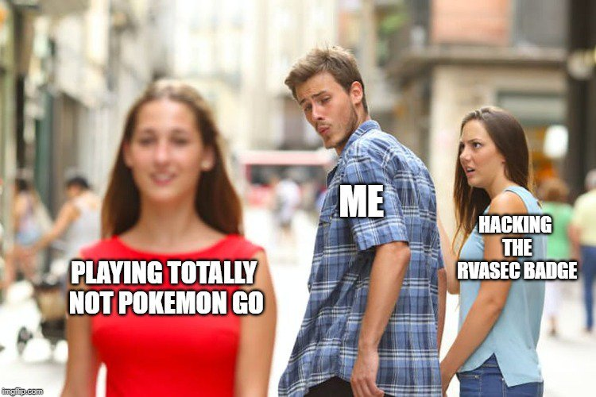](https://www.hackrva.org/wp-content/uploads/2019/07/D7LWh8HVsAE2nKy.jpg)

Some Badge Monsters:

[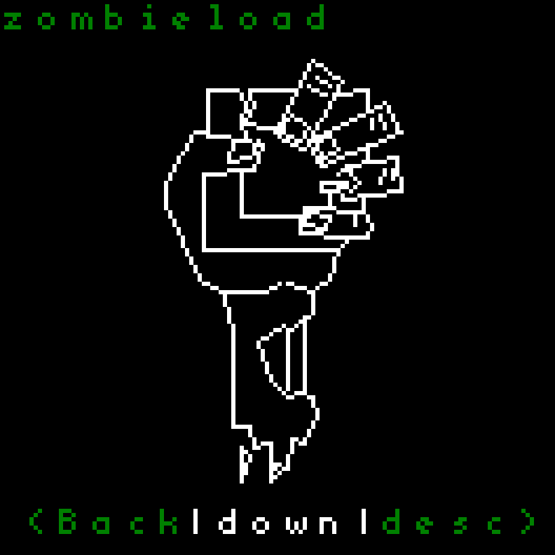](https://www.hackrva.org/wp-content/uploads/2019/07/image.png) [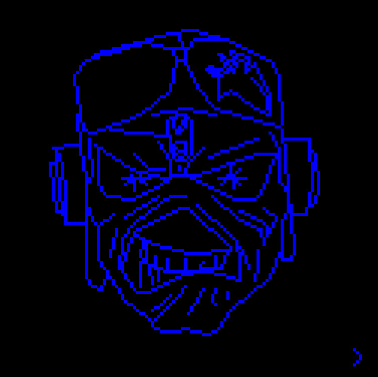](https://www.hackrva.org/wp-content/uploads/2019/07/eddiescreenshot.jpg)

[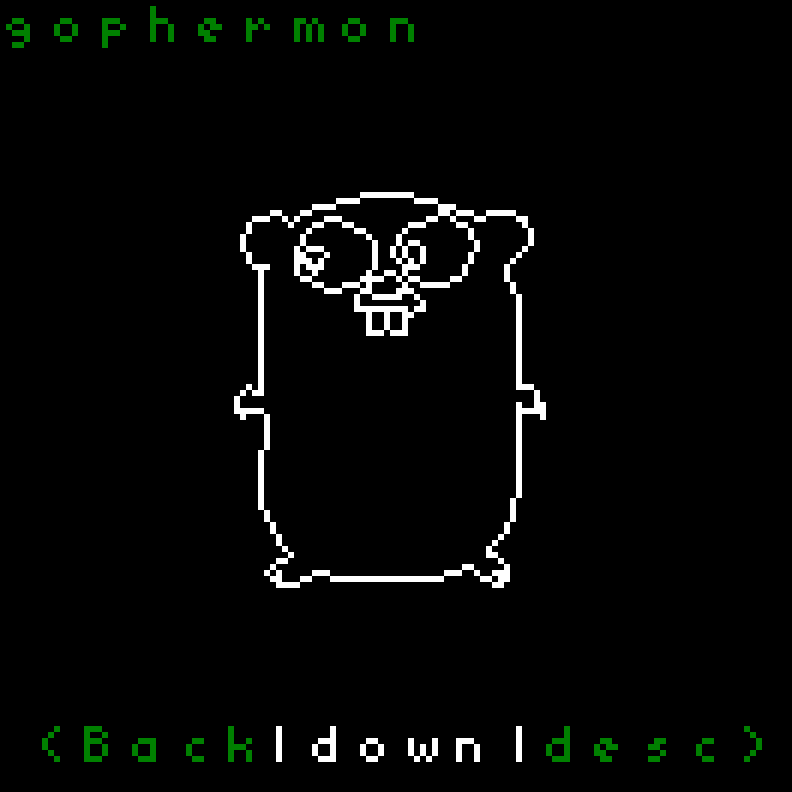](https://www.hackrva.org/wp-content/uploads/2019/07/image-3.png)[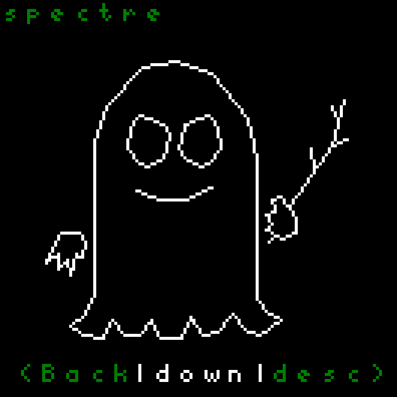](https://www.hackrva.org/wp-content/uploads/2019/07/image-1.png)[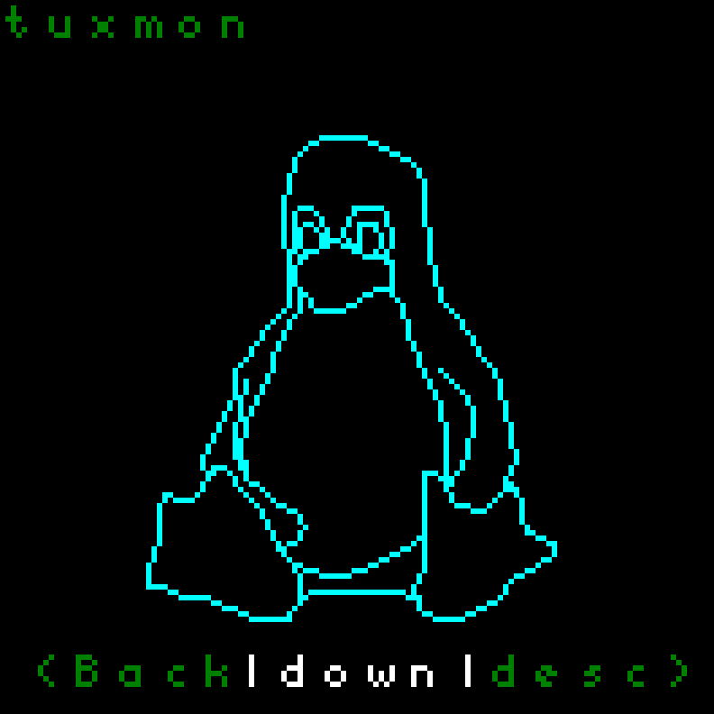](https://www.hackrva.org/wp-content/uploads/2019/07/image-2.png)

#### C interpreter/CTF:

There was a C interpreter on the badge this year.  It was used by some during the CTF (capture the flag).

#### Prototype of 2019 Badge:

[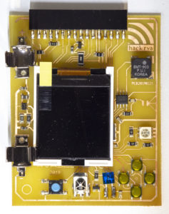](https://www.hackrva.org/wp-content/uploads/2019/07/Badge_Prototype.jpg)

#### Group Photo of Badge Team 2019 (many people not pictured):

[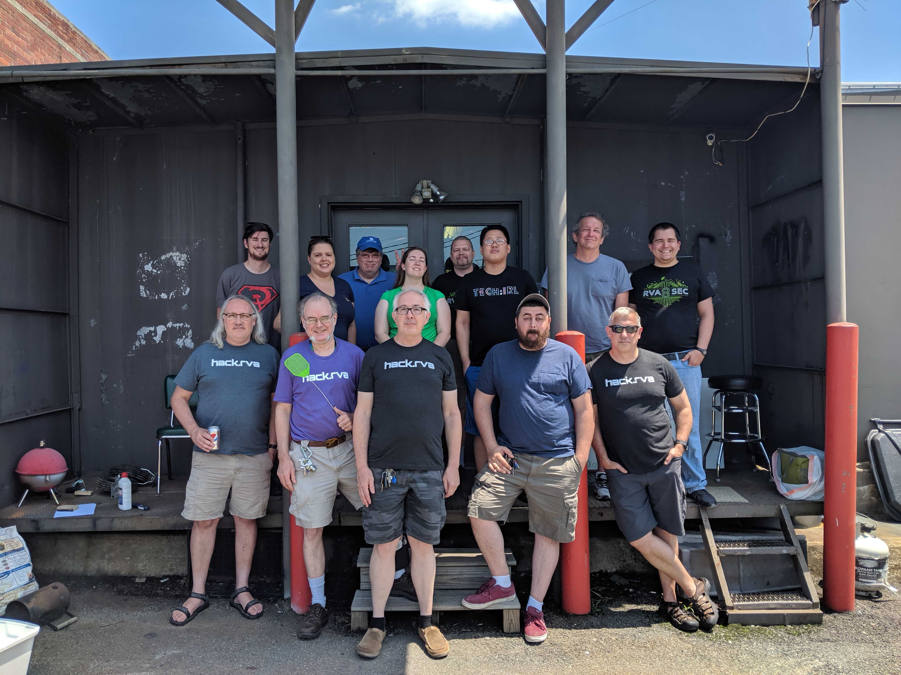](https://www.hackrva.org/wp-content/uploads/2019/07/IMG_20190714_142138.jpg)

 

#### A look back to Badge 2014:

[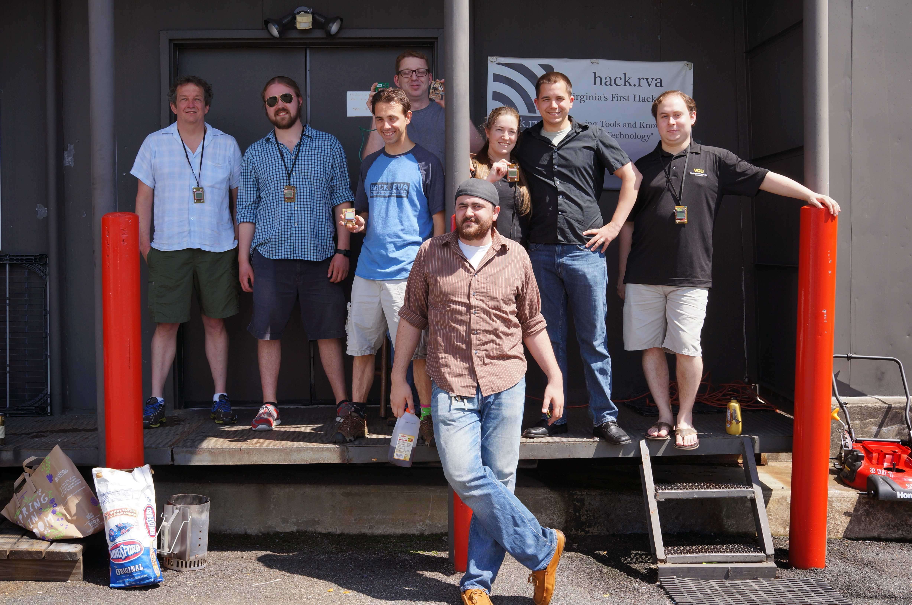](https://www.hackrva.org/wp-content/uploads/2019/07/DSC00635.jpg)
