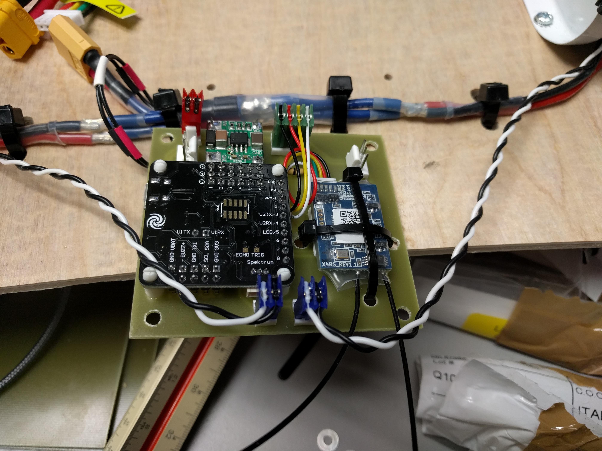

Hear that whirring buzz in the distance? Is it a swarm of cybernetic bees, a fleet of drones, or a group of futuristic swamp boats retro fitted to operate on land?

No...

It's Caster Car MADNESSssSSSSSS!!!!!

(Which may be a weird amalgamation of all of those things.)

**What is a caster car?**

Caster Cars were invented by HackRVA Member and resident expert on multi-rotor vehicles Andy Fabian.

A Caster Car is a land vehicle built out of multi-rotor (drone) parts and [casters](https://en.wikipedia.org/wiki/Caster) for wheels.

Several HackRVA members have built their own caster cars.  We even have a slack channel dedicate to support members who are working on their own build.

 

Be sure to ask about caster cars the next time your visit HackRVA.

https://youtu.be/4gd6kQSdSgY

 

in progress caster car rebuild:

 
