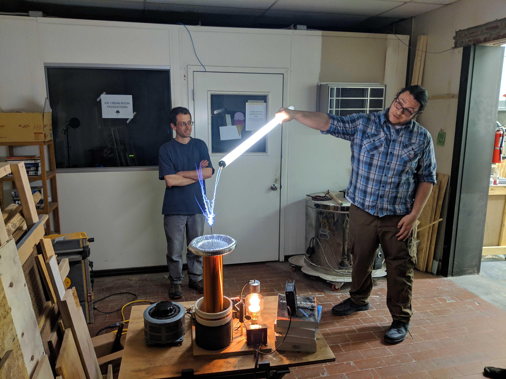

HackRVA hosts open house every Thursday evening from 7pm to 9pm.

\[For clarity, we did when this was written but not now in the time of COVID.\]

This is a good time to checkout the space and socialize with HackRVA members.

There's usually some interesting conversation.

(e.g. 3d waffles, button making, lasers, LEDs, programming, woodworking, electronics, 3d printing, dirigible humor, etc.)

Sometimes people bring in cool projects to show off like this awesome tesla coil!

Follow our meetup page to see other upcoming events.

https://www.meetup.com/HackRVA-Meetup/
