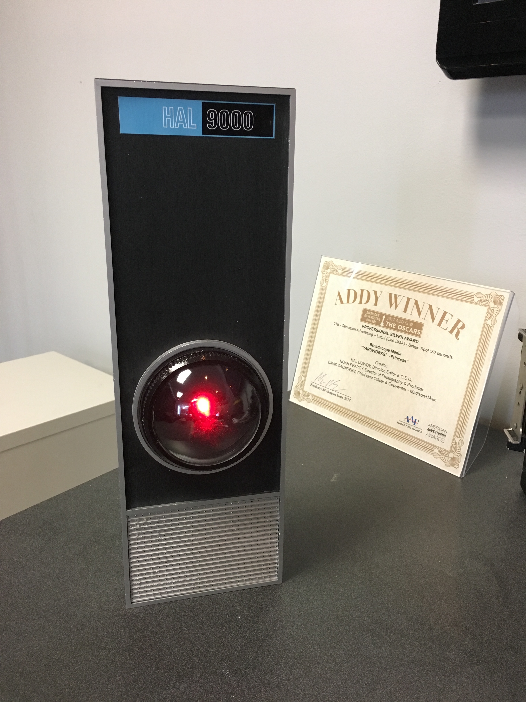
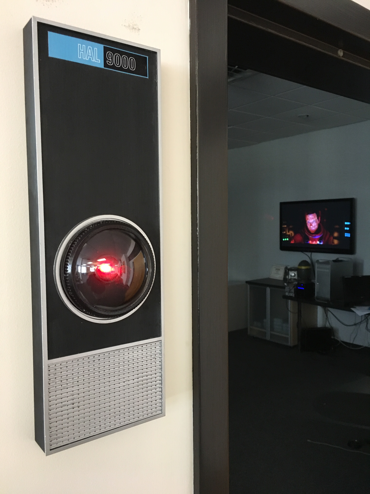
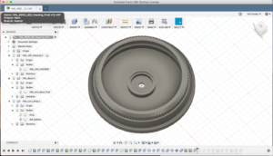
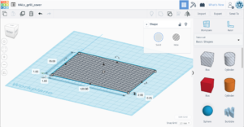
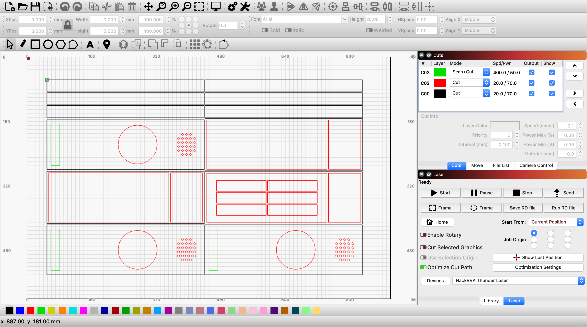

Should I be concerned when my Alexa says that it can't do that?

This Hal9000 (from the 1968 film 2001: A Space Odyssey) was built by a fella named Hal.

This project used a digital design process and took advantage of HackRVA's laser and 3D printers.

The clear lens was from a plastic Christmas ornament.

 

Screenshots of design files:

Eye:

Grill:

File being prepared for the laser cut:

