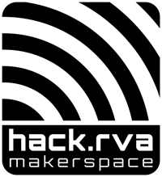

Recently we rolled out a Quarterly Goal initiative (sometimes we call it our [BHAG](https://wiki.hackrva.org/index.php/The_HackRVA_Quarterly_Goal) .) We rally together to brainstorm, plan, and execute many small tasks that work toward one big goal.

This time around, the goal was to improve on-boarding and new member experience.  Many people contributed and it seems to have been a great success.

#### What did we accomplish?

1. We had a planning session
2. We had a meetup where we executed several ideas
3. New Member On-boarding Process -- defined and documented
4. New Member Orientation Process -- [orientation checklist](https://wiki.hackrva.org/images/c/cc/Member_Orientation_Checklist_v0.0.1.pdf) made
5. Member Sign up Station (tablet on table under TV)
6. Name-Tags -- diy or low-tech paper
7. Purchased some safety equipment (e.g. hair ties, first aid kits, etc...)
8. Fixed automated Slack invite
9. Member Handbook/Welcome Packet -- kicked off/in progress

#### How Did we celebrate?

A big part of this process is to report and celebrate progress.

We signed up several members while we worked on the new on-boarding process and most importantly **we had an awesome cookout. :)**

Overall, it has been a great success.

We are already busy planning and brainstorming what next quarters big goal is.  Stop by the space and ask someone about it.

The best time to join HackRVA is right now.

