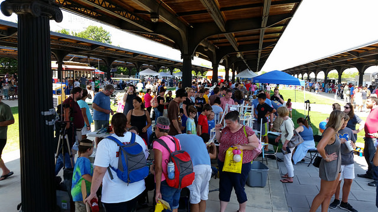

Hello visitors and fellow makers!

This blog is temporarily on break until a new champion of documentation and blogging rises to the call!

Please enjoy the posts of days gone by and feel free to explore the other areas on our site that show what we’re up to.

Explore our [wiki](https://wiki.hackrva.org/) for information about our tools.

[Our meetup page](https://www.meetup.com/HackRVA-Meetup/) is especially good for checking out events both past and future.

And [don’t forget the photos](https://www.flickr.com/photos/hackrva/)! So many projects!

If you’re a member and want to stay in the know, be sure to join [our slack channel](https://hackrva.slack.com/?redir=%2Fmessages%2Fgeneral%2Ffiles%2FF02J2VCFG).

HackRVA is alive and well. We’re always up to something. For now, we’re just not posting as much.

Until then, see you at the space!
